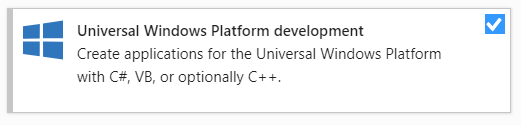
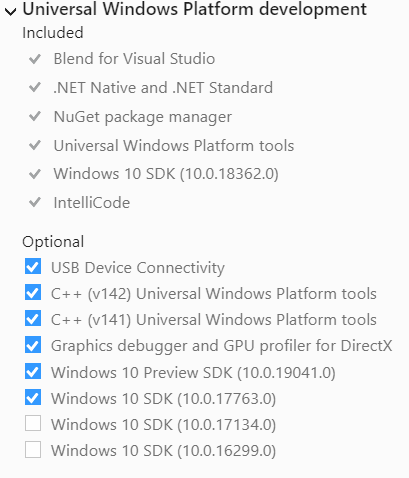
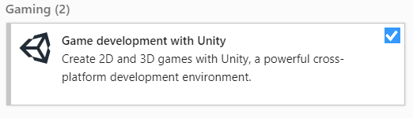
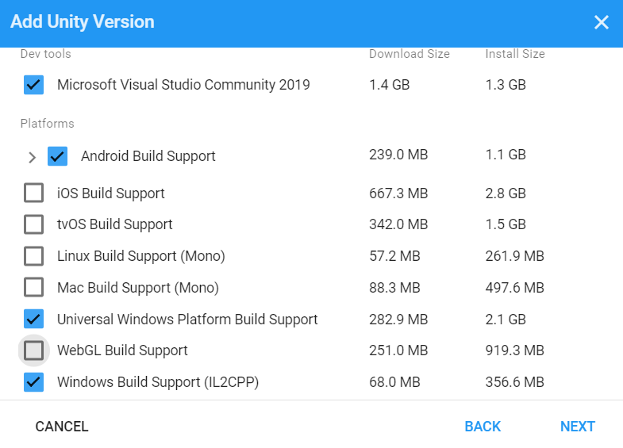
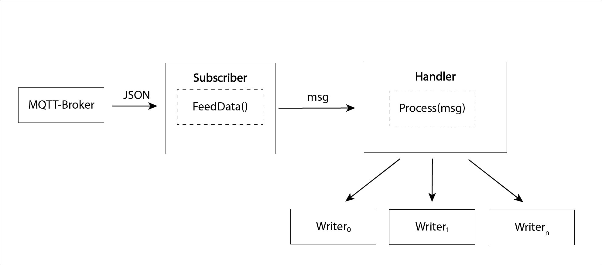
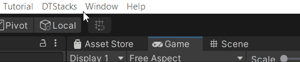
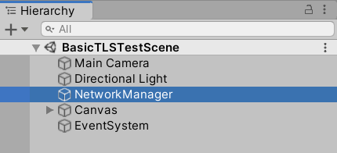
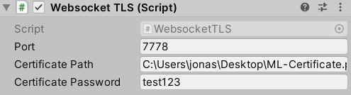

# MirrorLabs

This project aims to establish a generic bridge between a robotic system (operating ROS) and Unity3D using ROS# (Using the 
unity asset [ROS#](https://assetstore.unity.com/packages/tools/physics/ros-107085) published by Siemens). This project is partially derived from the [Rviz2AR](https://github.com/Awesome-Technologies/Rviz2AR) repo published by 
[Awesome-Technologies](https://awesome-technologies.de/). Besides a generic Unity-Ros-Bridge it is planned to modify the [Rviz2AR](https://github.com/Awesome-Technologies/Rviz2AR) project for the recently available HoloLens 2.

The current state of the project includes the following content:

- MirrorLabs_Desktop directory, the complete unity project used directly for development of the generic UR5 ROS-Unity-Bridge. (Executable on Windows 10)
- MirrorLabs_HL2 directory, derivative of the desktop version for Augmented Reality using Microsoft Hololens (0.18362 or higher)
- MirrorLabs_Android directory, derivative of the desktop version for AR/VR using Android based systems 
- Networking directory, here a safe (encrypted) network communication is established, including a sample project (`Mirror-Networking_encrypted MP`) and a necessary Openssl (`Win64OpenSSL-1_0_2u.exe`) executable.
- DTStacks directory, the new, MQTT-based, communication module including a comprehensive library of common ROS messages and sample publishers/subscribers 

## How to use 
To get started with the Mirrorlabs framework, the external elements need to be perpared. This can eiter be conducted before, after or in parallel to working on the unity projet itself. Below  two ways of perparing the external link are described, follow along and the project will be working in no time. 
### External Setup (ROS-IOT)
Since with the implementation of the MQTT module we are no longer restricted to ROS-systems via the original ROS# approach, this section is devided into multiple parts. Starting with the original ROS# setup using the [rosbridge_suit](https://github.com/RobotWebTools/rosbridge_suite). This will then be followed by the alternative MQTT setup for ROS systems and a general description of how to get started with any IoT device. 
#### ROS#
Set up ROS (melodic used for development, other may be compatible) environment,  
including the [rosbridge_suit](https://github.com/RobotWebTools/rosbridge_suite),
[ros-sharp ROS-components](https://github.com/siemens/ros-sharp/tree/master/ROS),
[Gazebo](http://gazebosim.org/), and download/install the latest [UR ROS package](https://github.com/ros-industrial/universal_robot).

Once the all packages are installed, open the `ur5.launch` file, located under `universal_robot/ur_gazebo/launch`. 
Add the following lines to the launch procedure: 
```
<include file="$(find file_server)/launch/ros_sharp_communication.launch" > 
     <arg name="port" value="9090"/>
</include>>
 ```

Try out if the installation was succesful by activating the `ur5.launch` file.
```
$ roslaunch ur_gazebo ur5.launch
```

If everything works out, the gazebo GUI will open and the ROS-side of the setup is completed.

Follow this procedure for any robot launch file to enable a connection to Unity-based applications.

#### ROS-MQTT
We as an organization are mostly using the [mqtt_bridge](http://wiki.ros.org/mqtt_bridge) maintained by `groove-x`. Follow along with the install instructions
available under [mqtt_bridge github](https://github.com/groove-x/mqtt_bridge). 

Note: If you develop for Python 2.7 (ROS Kinetic or Melodic), switch the branch in the repository! 


### Visual Studio 2019 
Instead of installing Unity first, the visual studio integration seemsto work better 
if Visual Studio is already present during Unity Installations. If Visual Studio 2019 is already installed, feel free to skip step 1,
only open the Visual Studio Installer. Next to the available installation of [Visual Studio 2019](https://visualstudio.microsoft.com/)
click on the `modify` button to enter the extension selection menu

1. Download [Visual Studio 2019](https://visualstudio.microsoft.com/) from [here](https://visualstudio.microsoft.com/downloads/), 
the version does not matter, Visual Studio 2019 Community is already sufficient and free of charge for non-commercial usage. 
(Note: This includes sufficient for HoloLens development!)
This will trigger the Visual Studio Installer to be downloaded, once the download is done, launch the Visual Studio Installer. 
Click through the Visual Studio Setup until it request a specification of extension to be installed.

2. Manage your [Visual Studio 2019](https://visualstudio.microsoft.com/) extension:
Once the overview of extensions is displayed, select the options for `Universal Windows Platform` [UWP, for HoloLens development]. (Make sure `C++ (v142) Universal Windows Platform tools`, 
`C++ (v141) Universal Windows Platform tools` as well as `Windows 10 SDK (10.0.17763.0)` are selected.)
<br/>
<br/>
Futher, select `Game Development with Unity`, this will enable [Visual Studio 2019](https://visualstudio.microsoft.com/) to directly attach compiled code to [Unity3D](https://unity.com/).
If all extensions are selected hit the `install` (or `modify`, if it an installation was already available) button in the bottom right corner and wait until it is finished.<br/>
<br/>


This concludes the [Visual Studio 2019](https://visualstudio.microsoft.com/) installation. Note: Earlier versions of Visual Studio are not supported for HoloLens developments anymore


### Unity 2019.4.10f1 (or later)


#### Installation
1. Install/Update [UnityHub](https://unity3d.com/get-unity/download), make sure to click on `download Unity Hub`. Once it is downloaded and installed,
click on the left hand side of the UnityHub GUI onto `Installs`. (After a fresh installation of Unity Hub this is empty.) 
Now we add a new installation by clicking on the `Add` button on the top right of the UnityHub GUI. On the appearing pop-up select `Unity 2019.4.3f1` (or later) and click on `Next`.

2. Configure the extensions to be installed alongside the general Unity Editor. Select `Microsoft Visual Studio Community 2019` in the `dev tools`-category, proceed by selecting `Android Build Support` and expanding the options for it. 
There enable `Android SDK & NDK Tools` and `Open JDK` to let Unity get a hold of the latest SDKs, it is possible to do this manually but it is unnecessary extra work. 
Further down make sure that `Universal Windows Platform Build Support` and  `Windows Build Support (IL2CPP)` are selected as well. 
(Within this project, iOS, Mac and Linux platform support is not considered but feel free to costumize your install further).<br\>


#### Project Integration

Clone this repo to your local storage (SSD storage highly recommended!), once everything appears in your file explorer, 
open `Unity Hub` and head to `Project` tab (left hand side of the GUI). Here all (to UnityHub) known local projects are displayed, to add the 
`MirrorLabs_XYZ` project, click on the `ADD` button, navigate to the just downloaded repo and select the `MirrorLabs_XYZ` directory.
Now the `Unity Hub` added the new project and by clicking on it, it will launch the Editor. (Note: This can take a moment.)

#### Unity Project Setup

Note: Upon opening the project, a multitude of warnings may be displayed in the console. These can safely be ignored and will be resolved with future updates.

Once the `Unity Editor` is launched, find/locate the `MirrorLabs` folder, open the `scenes` directory and double-click the `ML_UniversalRobotic_ur5` scene. 
This will load the base scene for all UR5 developments, use-case specific scenes will be available within the scene-folder once they are finalized. 
All scenes in development are indicated with the preamble "Dev_", all finalized scenes with "ML_".


#### ML_UniversalRobotic_ur5 scene overview

The current ML_UniversalRobotic_ur5 scene conists of a [UR5](https://www.universal-robots.com/products/ur5-robot/)-object, the `RosConnector`-object, a `Main Camera`-object, a `Directional Light` and an `EventSystem`.
The magic within this Unity project is done using the [ROS#](https://assetstore.unity.com/packages/tools/physics/ros-107085) Unity Asset published by Siemens.  Below follows a quick overview of the purpose of each beforehand mentioned object

1. `UR5 model`, imported using the URDF importer included in the [ROS#](https://assetstore.unity.com/packages/tools/physics/ros-107085) 
asset and modified to be used with the preselected `universal rendering pipeline` [URP]. It serves as direct visualization model of a physical robot.

2. `RosConnector`, contains the networking components which forward the messages, handles  publishing topics, subscribtions etc, between the remote system and the primary ROS environment. This can be configured relatively quickly depending on the purpose. 
Note: Please keep in mind to prevent a loop of messages. (e.g. do not listen to \joint_states while sending these at the same time.)

3. To place the digital robot, the "Object Manipulator"- script (include in the MRTK) is attached to its base transform. Making it possible to drag and drop it into any location of choice. (Note: The robot needs to have at least one working collider attached.)


#### MQTT Integration

As announced with the inital publication of the Mirrorlabs framework, the integration of a MQTT based communication was in the making. With this update, the first version of this integration is concluded. In the general, the interaction with the newly established framework remains largely identical. However, under the hood, this framework operates using an MQTT subscriber/publisher system, meaning an mqtt broker needs to be set up additionally. Some well functioning brokers are free and easy to set up, within the Mirrorlabs project, the [Mosquitto broker](https://mosquitto.org/download/) was mainly used.

With this new communication asset, it is now possible to not only have a data-link to ROS-systems but any Iot device with little to no difficulty since MQTT is widely spread within research, industry and even hobbyists! 

### How to use 
The framework is derived from the publically available (free for non-commercial purposes) [DTStacks repository](https://github.com/fate4gle/DTStacks) (Short for `Digital Twinning Stacks`) published and maintained by `fate4gle`. The core idea is centered around modularity, where for most cases a 3-stage data-pipeline is used. This consists of a communication (publisher/subscriber), Handler and Action (reader/writer) module. 



This measure is implemented, to enable simplified switching between each used component without the need to setup a completely new object or data-chain. E.g. switching between `ROS#` and `MQTT` as the communication module.
To get started with the new MQTT system, simply import the unitypackage from this repository into your own project and have a look a the simple demo scene under `DTStacks>UnityComponents>Scenes>DemoScene`. In this scene, a UR5 is used to demonstrate the new data-flow and interration. Simply move a joint of the publishing robot (e.g. shoulder) and the subscribed robot will follow!

Note: In order for this to work, you need to enter the details of your MQTT-broker at the subscriber and publisher module.

A secondary scene is provided, based on a previous research effort to create a warning system which will instruct a system to slow down or shut off based on the proximity of the operator (Virtual Robot Cage concept). Within this scene, a Doosan M1013 is used to demonstrate how an operator could recognice variable stages of danger when approach a robot. Starting with a yellow warning-zone which is activated once the operator approach the robot. A red danger zone surrounding the immediate physical links of the robot, when these are entered, the robot is slowed down to minimum while an emergncyActionMsg is send out to the MQTT broker.

### Creating a custom data-pipepline
Similar to ROS# message generator, this framework supports the generation of new messages based on all known predefined messages in the project. Simply type in a name and configure the content of your message. Furthermore, if instructed to, this will automatically create a subsciber and publisher for this new message. Hence, establishinng a new datalink is a matter of minutes. To create a new mesasge, click in the Taskbar on `DTStacks>Create>Messages`. 



From here, start constructing your new message to your liking.


#### Networking 
The networking project is based on the open source network project `mirror-networking` by [vis2k](https://mirror-networking.com/). To use the networking project, the project `Mirror-Networking_encrypted MP` 
needs to be included as a new unity project (Unity 2019.4.3f1). Further, the project requires a TLS compatible certificate. 
If not present already please follow the youtube tutorial of `Kevin WiBit` which can be found [here](https://www.youtube.com/watch?v=1xtBkukWiek). 
The necessary executable (Windows only) is available in the root folder `Networking`.



With the certificate available, open the `BasicTLSTestScene` within the unity project (Assets/Scenes/BasicTLSTestScene), select the `NetworkManager` Object and change the 
`Certificate Path` of the `Websocket TLS` script to your local certificate (.pfx).

 

Note: Change the password to your certifacte password!


#### Vision and Development

The following developments are currently in progress: 

* Streamlining both communication methods for simple interchanges between ROS# and MQTT
* Implementation of a simple socket-based data entry point
* GUI development for VR (Oculus Quest).


#### Notes

First start your UR5 simulation within ROS and start the Unity side afterwards, in the `Console Box` of Unity (if still in the editor and not ported to another platform yet), a message regarding the connection state will appear shortly after launching the scene.
(This message will appear and warn of an unsucessful ROS-connection attempt, verify your IP and port parameters and try it again by hitting the `connect` button. Check the `Console Box`-message regarding the outcome.)


